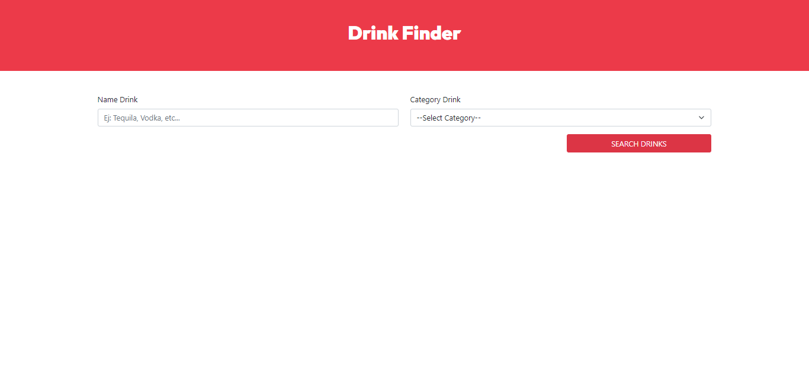
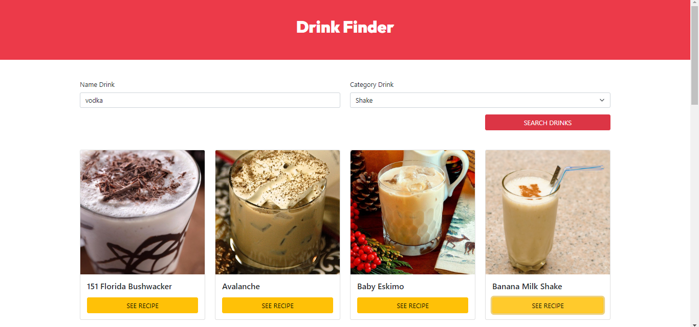
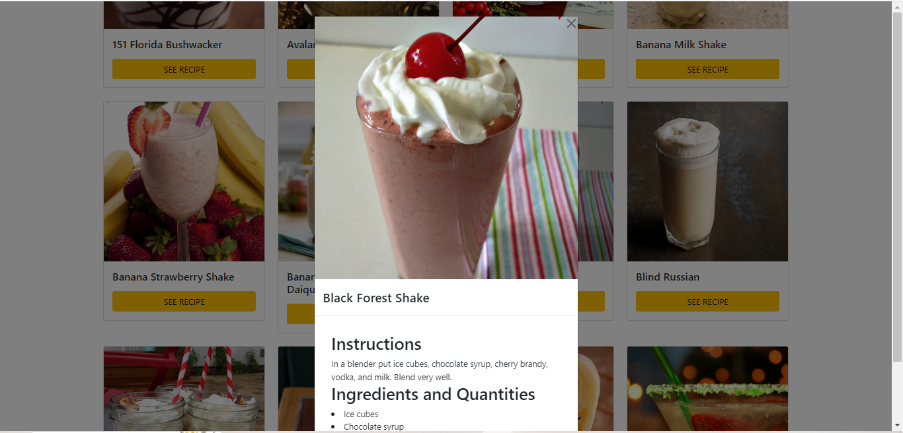

<div align="center">
  
  <h3><b>Drink Finder App</b></h3>

  
  
  

  <br/>

</div>

# 📗 Table of Contents <a name="table-of-contents"></a>

- [📗 Table of Contents](#-table-of-contents-)
- [📖 About the Project](#-about-the-project-)
  - [🚀 Live Demo](#-live-demo-)
  - [🛠 Built With](#-built-with-)
    - [Tech Stack](#tech-stack-)
    - [Key Features](#key-features-)
  - [🚀 Getting Started](#-getting-started-)
    - [Prerequisites](#prerequisites)
    - [Setup](#setup)
    - [Install](#install)
    - [Usage](#usage)
  - [👥 Authors](#-authors-)
  - [🤝 Contributing](#-contributing-)
  - [📝 License](#-license-)

<!-- PROJECT DESCRIPTION -->

# 📖 About the Project <a name="about-project"></a>

**Drink Finder App** is a web application that allows you to search for drinks and view their recipes through a modal window. The application connects to an API to obtain data and information about the drinks. It is built with React, Vite and uses Context API for state management. It also uses Bootstrap for UI design and styling.

This app was created as part of the course "React - The Complete Guide: Hooks Context Redux MERN +15 Apps"!

Use the API of: https://thecocktaildb.com/api.php

<!-- LIVE DEMO -->

## 🚀 Live Demo <a name="live-demo"></a>

- [Live Demo](https://drink-finder-react-fawn.vercel.app/)


<p align="right">(<a href="#readme-top">back to top</a>)</p>

## 🛠 Built With <a name="built-with"></a>

### Tech Stack <a name="tech-stack"></a>

<details>
  <summary>Cliente</summary>
  <ul>
    <li>HTML, JavaScript</li>
    <li><a href="https://reactjs.org/">React.js</a></li>
    <li><a href="https://es.vitejs.dev/">Vite</a></li>
    <li>Context API</li>
    <li>Bootstrap</li>
  </ul>
</details>

# 🚀 Getting Started <a name="getting-started"></a>

To get a local copy up and running, follow these steps.

### Setup

1. Clone this repository to your desired folder:

```sh
git https://github.com/cilfonegabriel/drink-finder-react.git
cd drink-finder-react

### Install

After cloning the repo, navigate into it and install all the required packages with the following command:

```sh

### Install

After cloning the repo, navigate into it and install all the required packages with the following command:

```sh

npm install


```

Then just wait for everything to finish downloading.

### Usage

Start the React app:

`npm run dev`

Runs the app in the development mode.\
Open [http://localhost:3000](http://localhost:3000) to view it in your browser.

The page will reload when you make changes.\
You may also see any lint errors in the console.

`npm run eject`


### Deployment

You can deploy this project using:

`npm run build`

This project is deployed in Vercel.

See the section about [deployment](https://facebook.github.io/create-react-app/docs/deployment) for more information.

<p align="right">(<a href="#readme-top">back to top</a>)</p>

<!-- AUTHORS -->

## 👥 Authors <a name="authors"></a>

👤 **Gabriel -Cilfone**
- GitHub: [Gabriel Cilfone](https://github.com/cilfonegabriel)
- LinkedIn: [Gabriel Cilfone](www.linkedin.com/in/gabriel-cilfone/)

<p align="right">(<a href="#readme-top">back to top</a>)</p>


<!-- CONTRIBUTING -->

## 🤝 Contributing <a name="contributing"></a>

Contributions, issues, and feature requests are welcome!

Feel free to check the [issues page](https://github.com/cilfonegabriel/drink-finder-react/issues).

<p align="right">(<a href="#readme-top">back to top</a>)</p>

<!-- SUPPORT -->

<p align="right">(<a href="#readme-top">back to top</a>)</p>

<!-- ACKNOWLEDGEMENTS -->

## 🙏 Acknowledgments <a name="acknowledgements"></a>

 This app was created as part of the course "React - The Complete Guide: Hooks Context Redux MERN +15 Apps"!
<p align="right">(<a href="#readme-top">back to top</a>)</p>

## 📝 License <a name="license"></a>

This project is [MIT](./LICENSE) licensed.

<p align="right">(<a href="#readme-top">back to top</a>)</p>